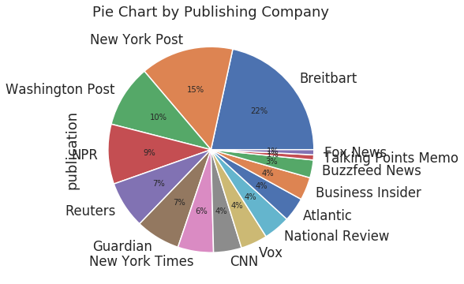
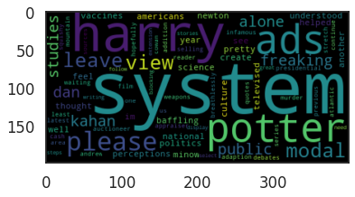
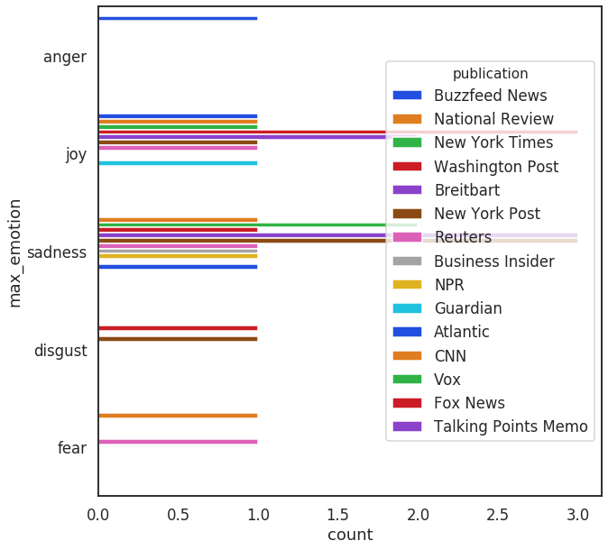

# All The News Sentiment Analysis

### Sentiment Analysis was performed on a variety of articles from 15 different news sources.
 ---
#### *Pie Chart showing percentage of articles by publishing company (taken from a subset of 500 articles.)*
 

#### *Word map showing distribution of words within an article.*

#### *Example of emotional analysis obtained using IBM Watson's Emotional Analysis API (subset of 30 articles) *

